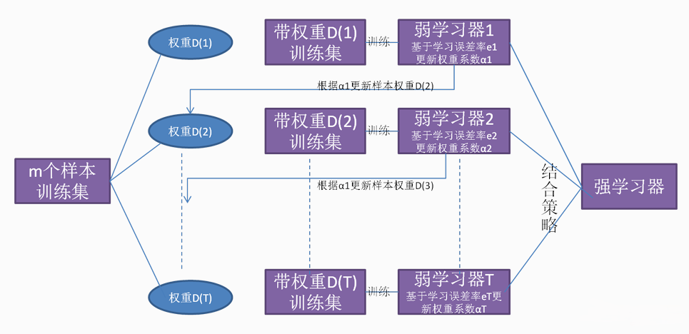
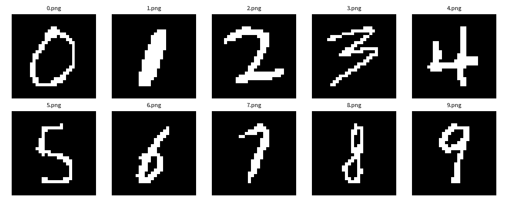
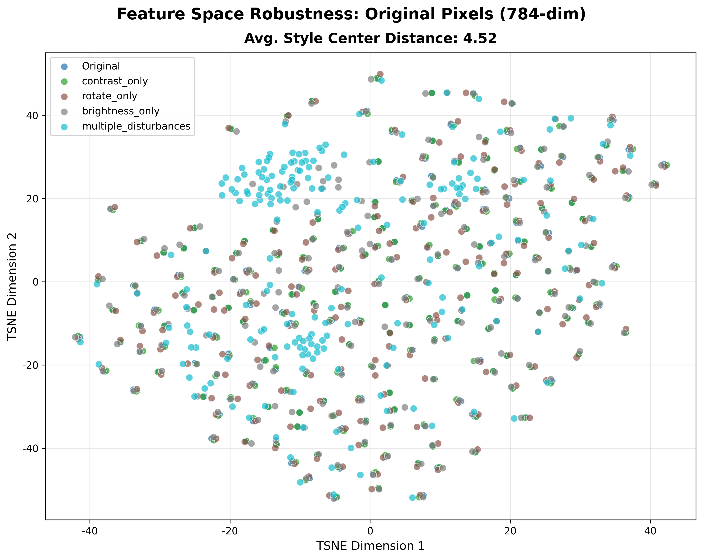
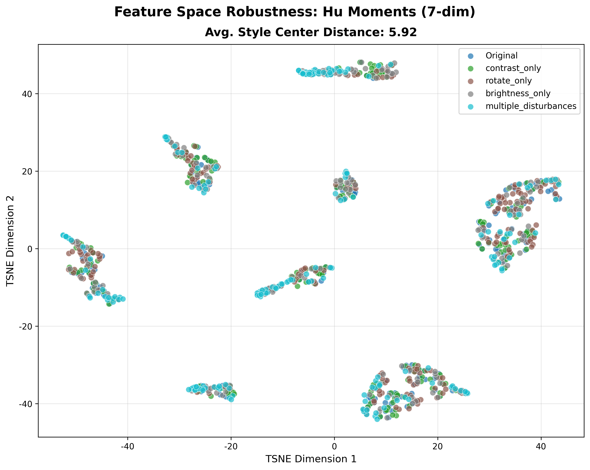
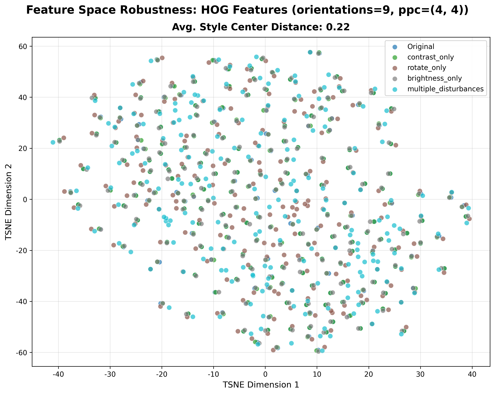
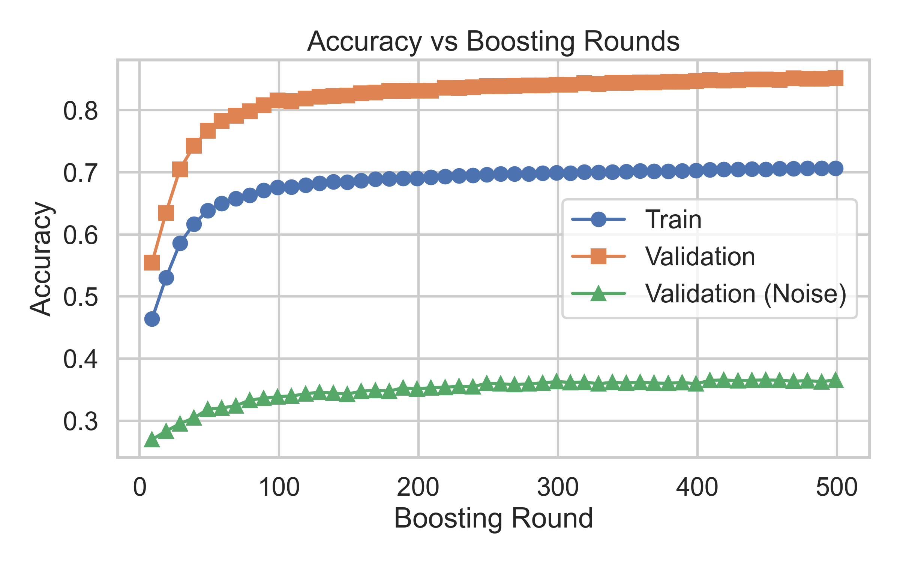
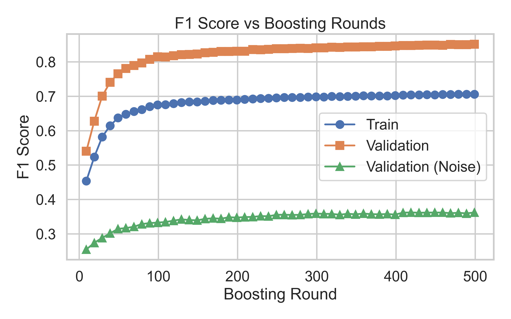
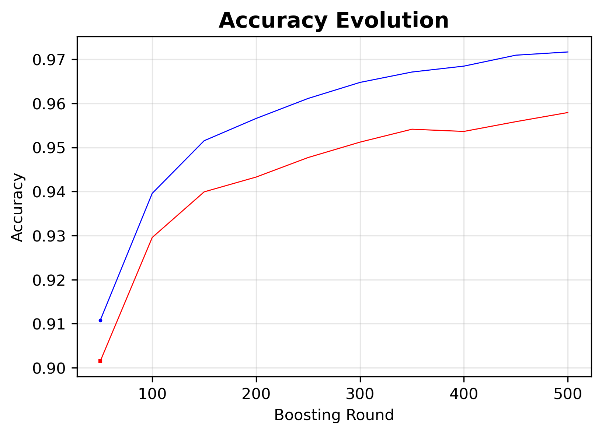

# AdaLab

**AdaLab** 是一个面向研究的 **AdaBoost 实验园地**，以手写数字图像分类任务为背景，系统性地研究 **AdaBoost 算法的过拟合行为、泛化能力与鲁棒性特征**。

项目提供了一个成熟的 Python 实验框架与 CLI 工具，支持通过 **JSON 配置文件** 驱动端到端实验流程，实现**零代码运行实验**，适用于算法分析、实验复现与对比研究。

---

## 目录

- [项目特点](#项目特点)
- [AdaBoost 模型原理](#adaboost-模型原理)
- [任务与数据处理](#任务与数据处理)
- [特征提取](#特征提取)
- [实验结果](#实验结果)
- [鲁棒性与泛化能力分析](#鲁棒性与泛化能力分析)
- [环境配置](#️-环境配置)
- [使用方法](#使用方法)
- [配置文件说明](#配置文件说明)

---

## 项目特点

### 1. 端到端实验框架

* 提供完整的 **训练 → 评估 →（可选）可视化** 实验流程
* 实验参数统一由 JSON 配置文件管理
* 实验结果自动保存，支持断点评估与后处理

### 2. AdaBoost 核心机制可观测

* 扩展 `sklearn.ensemble.AdaBoostClassifier`
* 内置 **BoostMonitor**，可精细监控：
  * 样本权重分布演化
  * 噪声样本与干净样本权重变化
  * 每一轮弱分类器的 `alpha`
* 支持传入 **验证集**，实时跟踪验证性能，用于分析过拟合现象

### 3. 面向鲁棒性研究的数据处理模块

除标准的数据流程外，AdaLab 特别关注 **数据扰动与鲁棒性验证**：

* 标准数据集划分（训练 / 测试 / 验证）
* 特征提取支持：
  * HOG（方向梯度直方图）
  * Hu 不变矩
* 提供多种 **图像扰动方式**（噪声、破坏、变形等），用于系统性评估 AdaBoost 在非理想条件下的表现

### 4. CLI 驱动，零代码运行

* 提供统一的 `adalab` 命令行工具
* 支持多种运行模式（仅训练、训练+评估+可视化、仅评估已有实验）
* 适合批量实验与实验脚本化管理

### 5. 可选配套可视化模块

* 提供独立的可视化包 **adalab_viz**
* 对实验结果进行统一、结构化的可视化
* 与核心实验逻辑解耦，保持后端简洁

---

## AdaBoost 模型原理

### 核心思想

AdaBoost 是一种典型的提升（Boosting）型集成学习框架，其核心思想是：**通过多轮训练、聚焦难样本，把一群"弱学习器"提升为一个"强学习器"**。

* 在每一轮中，AdaBoost 都会为总模型增加一个新的学习器，直到模型的弱学习器个数达到预先指定的值
* 训练新学习器时，根据上一轮的推理结果在同一训练集上**重新分配样本权重**，使新的弱学习器更加关注上一轮中被分错或"难学"的样本
* 各轮得到的弱学习器本身能力都比较弱，但在最后通过加权组合（加权投票或加权求和），形成一个整体性能更高、泛化能力更强的强学习器

### 模型结构



### 算法流程

假设训练集包含 $m$ 个样本 $\{(x_i,y_i),\cdots,(x_m,y_m)\}$，在第 $t$ 轮训练中：

1. **计算弱学习器的加权错误率**

   $$\varepsilon_{t-1} = \sum_{i=1}^m \omega_{t-1,i}\,\mathbf{1}\{h_{t-1}(x_i)\neq y_i\}$$

2. **计算弱学习器的投票权重**

   $$\alpha_{t-1}=\frac{1}{2}\ln\left(\frac{1-\varepsilon_{t-1}}{\varepsilon_{t-1}}\right)$$

3. **更新样本权重**

   $$\omega_{t,i} = \frac{\omega_{t-1,i}\,\beta_{t-1}^{\,1-\mathbf{1}\{h_{t-1}(x_i)\neq y_i\}}}{\sum_{j=1}^m \tilde{\omega}_{t,j}}$$

   其中 $\beta_{t-1} = \frac{\varepsilon_{t-1}}{1-\varepsilon_{t-1}}$

**直观理解**：分类正确的样本权重减小，分类错误的样本权重相对增大，使得后续学习器更关注难分样本。

### 收敛性保证

只要每一轮的弱学习器都略好于随机猜测（$\gamma_t>0$），AdaBoost 在训练集上的错误率会随轮数 $T$ **指数级下降**：

$$\varepsilon_{train} \le \exp\left(-2\sum_{t=1}^T \gamma_t^2\right)$$

### 优缺点

**优点：**

* **泛化能力强**：在许多问题上不易过拟合（Margin 理论）
* **参数少**：原始算法几乎无需调参
* **通用性**：可与任何弱学习器结合

**缺点：**

* **对噪声敏感**：异常值权重会被过度放大
* **串行训练**：难以并行化，训练速度较慢

---

## 任务与数据处理

### 核心任务

训练一个 AdaBoost 分类器，对手写数字图片进行**多分类（十类）**识别。

### 数据集

* 使用 **MNIST 数据集**，按照 8:2 切分训练集和测试集
* 在 MNIST 测试集和课程提供的手写图片两组数据上分别测试

### 数据预处理流程

1. 所有图片转化为**黑底白字**
2. 按照包含该数字的**最小正方形**进行切割
3. 使用 `cv2.resize` 方法将图片缩放至 **20×20**
4. 将数字图片嵌入到 **28×28** 的纯黑色背景



---

## 特征提取

为了提升模型的泛化能力和对不同风格数据的适应性，AdaLab 支持多种特征提取方式：

### 特征类型

1. **原始像素特征**：将图片 reshape 为 (784,) 一维向量
2. **HOG 特征**：方向梯度直方图，捕捉边缘和纹理信息
3. **Hu 不变矩**：基于图像矩的 7 个不变特征，对旋转、缩放、平移具有不变性

### 特征空间可视化

通过 t-SNE 降维可视化不同特征提取方式下的特征分布：

<table>
<tr>
<td><br/><center>原始特征</center></td>
<td><br/><center>Hu 不变矩</center></td>
<td><br/><center>HOG 特征</center></td>
</tr>
</table>

从可视化结果可以看出，**HOG 特征**在特征空间中具有更好的类间分离度，因此能够获得更好的分类性能。

---

## 实验结果

### 训练参数设置

| 参数 | 值 |
|------|-----|
| **max_depth** | 3 |
| **max_features** | 0.3 |
| **criterion** | entropy |
| **n_estimators** | 500 |
| **learning_rate** | 0.5 |
| **random_state** | 42 |

### HOG 特征提取参数

| 参数 | 值 |
|------|-----|
| **orientations** | 9 |
| **pixels_per_cell** | [4, 4] |
| **cells_per_block** | [2, 2] |

### 性能对比

#### 原始像素特征

| 数据集 | 准确率 | 精度（宏平均） | 召回率（宏平均） | F1值（宏平均） |
|--------|--------|---------------|----------------|---------------|
| **MNIST** | 0.9184 | 0.9196 | 0.9180 | 0.9182 |
| **课程数据集** | 0.6 | 0.4 | 0.6 | 0.4667 |

#### Hu 不变矩特征

| 数据集 | 准确率 | 精度（宏平均） | 召回率（宏平均） | F1值（宏平均） |
|--------|--------|---------------|----------------|---------------|
| **MNIST** | 0.5208 | 0.5017 | 0.5113 | 0.5038 |
| **课程数据集** | 0.4 | 0.2333 | 0.4 | 0.2833 |

#### HOG 特征（最优模型）

| 数据集 | 准确率 | 精度（宏平均） | 召回率（宏平均） | F1值（宏平均） |
|--------|--------|---------------|----------------|---------------|
| **MNIST** | 0.958 | 0.9581 | 0.9578 | 0.9579 |
| **课程数据集** | 0.6 | 0.525 | 0.6 | 0.54 |

**结论**：HOG 特征在 MNIST 数据集上达到了 **95.8%** 的准确率，显著优于原始特征和 Hu 不变矩。

---

## 鲁棒性与泛化能力分析

### 1. 噪声鲁棒性

通过在训练集中人为添加不同比例的标签噪声，评估模型对噪声的适应能力。

<table>
<tr>
<td></td>
<td></td>
</tr>
</table>

**实验发现**：

* 随着迭代次数增多，噪声权重增大导致后续学习器逐渐关注训练集的噪声部分
* 实际训练中，更关注噪声的这部分学习器在最终得到的模型中权重很小
* 训练集噪声对模型训练的影响相对稳定，且无噪声测试集仍呈现较高的准确率

**结论**：训练模型虽然可以保证对纯净样本较高的准确率，但准确率随噪声增大而下降的现象仍然明显，训练时需要**尽量避免噪声干扰**。

### 2. 风格泛化能力

通过在测试集中引入不同的图像扰动（如位移、旋转、缩放等），评估模型的泛化能力。

<table>
<tr>
<td></td>
<td></td>
<td></td>
</tr>
</table>

**实验发现**：

* 加入不同扰动后，特征提取的效果明显
* 合适的特征提取能够有效减少风格本身的影响
* 最终呈现的模型准确率与无扰动数据差距很小

**结论**：特征提取是加强泛化能力的关键，需要**选择合适的特征提取方式**强化模型的泛化能力。HOG 特征在各种扰动下都表现出了良好的稳定性。

### 综合评价

* **噪声适应能力较强**：训练模型能够有效识别噪声并在合理迭代次数下减少噪声对模型的影响
* **泛化能力强**：风格扰动对模型训练的干扰不明显，HOG 特征提取显著提升了模型的泛化能力
* **特征选择关键**：合适的特征提取方式是提高模型性能的关键因素

---

##  环境配置

### 1. 创建并激活 Conda 环境

```bash
conda env create -f environment.yaml
conda activate adalab
```

### 2. 验证安装是否成功

```bash
which adalab
adalab -h
```

若能正常输出 CLI 帮助信息，则环境配置成功。

---

## 使用方法

### 查看 CLI 帮助

```bash
adalab -h
```

输出如下：

```text
usage: adalab [-h] --config CONFIG
              [--experiments-dir EXPERIMENTS_DIR]
              [--course-folder COURSE_FOLDER]
              [--viz | --viz-only]

AdaLab experiment runner (CLI)

options:
  -h, --help            show this help message and exit
  --config CONFIG       Path to json config file
  --experiments-dir EXPERIMENTS_DIR
                        Base directory that stores experiment runs
                        (default: experiments/)
  --course-folder COURSE_FOLDER
                        Course test folder used in evaluation
                        (default: ./data/test_images)
  --viz                 Train + eval + visualize after training
                        (requires use_monitor=true)
  --viz-only            Skip training; load existing experiment results
                        then eval + visualize
```

---

### 常见运行模式

#### 1. 仅训练与评估

```bash
adalab --config configs/exp1.json
```

#### 2. 训练 + 评估 + 可视化

```bash
adalab --config configs/exp1.json --viz
```

> 需要在配置文件中设置 `use_monitor = true`

#### 3. 仅对已有实验进行评估与可视化

```bash
adalab --config configs/exp1.json --viz-only
```

---

## 配置文件说明

所有实验参数均通过 JSON 配置文件控制，包括但不限于：

* 数据集与特征设置
* AdaBoost 超参数
* 训练与验证策略
* 是否启用监控与可视化

**配置文件的详细说明请参考：**

[`docs/config.md`](docs/config.md)

---

## 相关文档

* [CLI 使用指南](docs/CLI_GUIDE.md)
* [可视化方法说明](docs/VISUALIZATION_METHODS.md)
* [实验索引](docs/EXPERIMENTS_INDEX.md)
* [配置文件详解](docs/config.md)

---

## 许可证

本项目采用 MIT 许可证 - 详见 [LICENSE](LICENSE) 文件
